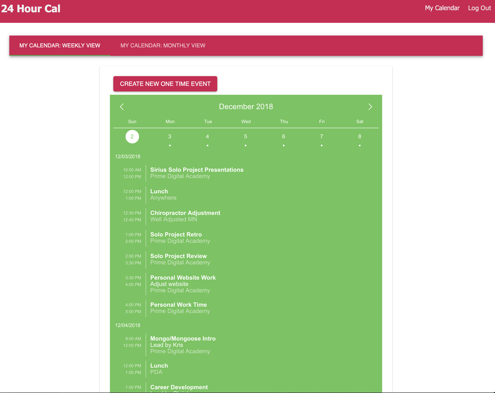
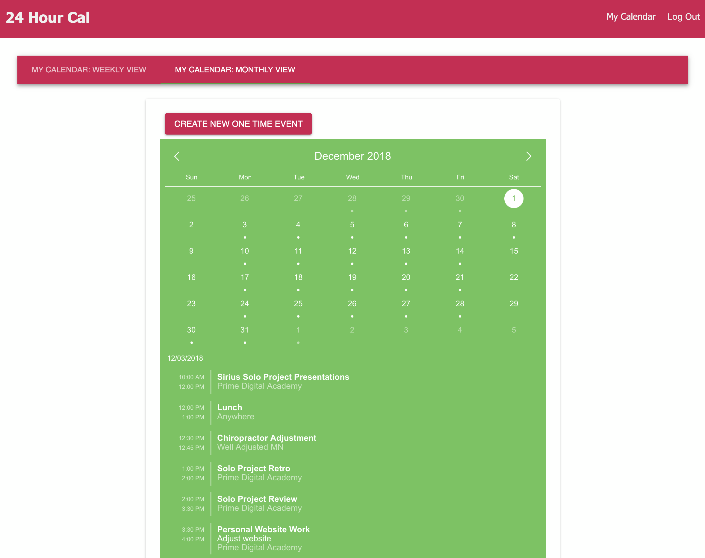

# 24 Hour Cal App

This is an event calendar app built in React with Redux, Sagas, Material UI, Node.js, Express.js, and Postgresql. It helps people easily create events. There is a weekly view, and monthly view. 

## Weekly View


## Monthly View


### SETUP

Create your PostgreSQL database and tables using the provided `database.sql` file. 

```
npm install
npm run server
```

Now that the server is running, open a new terminal tab with `cmd + t` and start the react client app.

```
npm run client
```